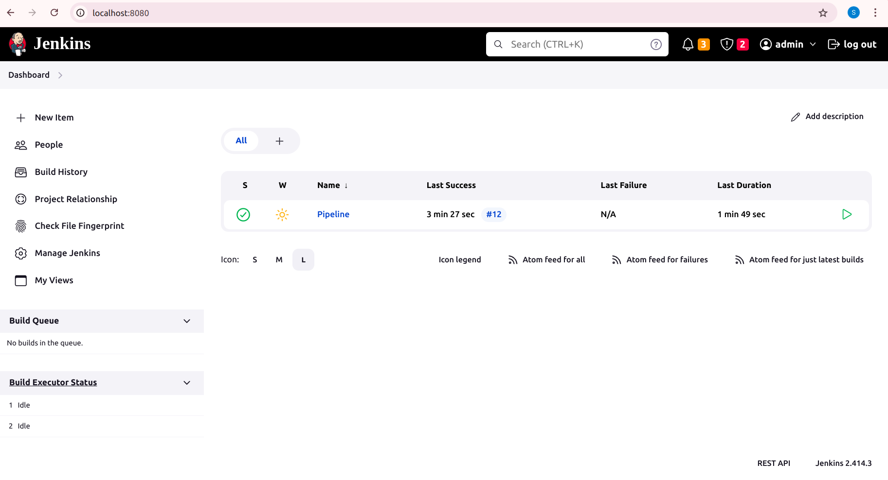
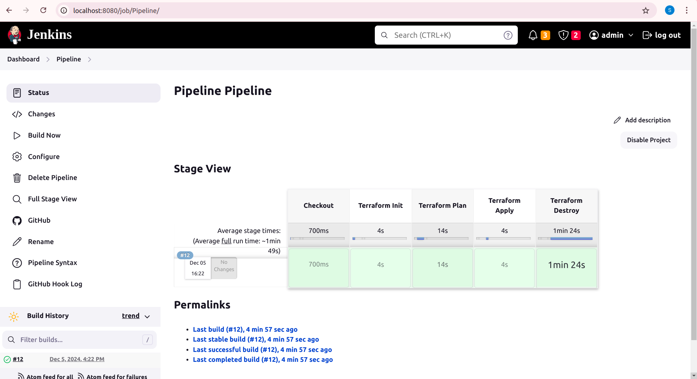
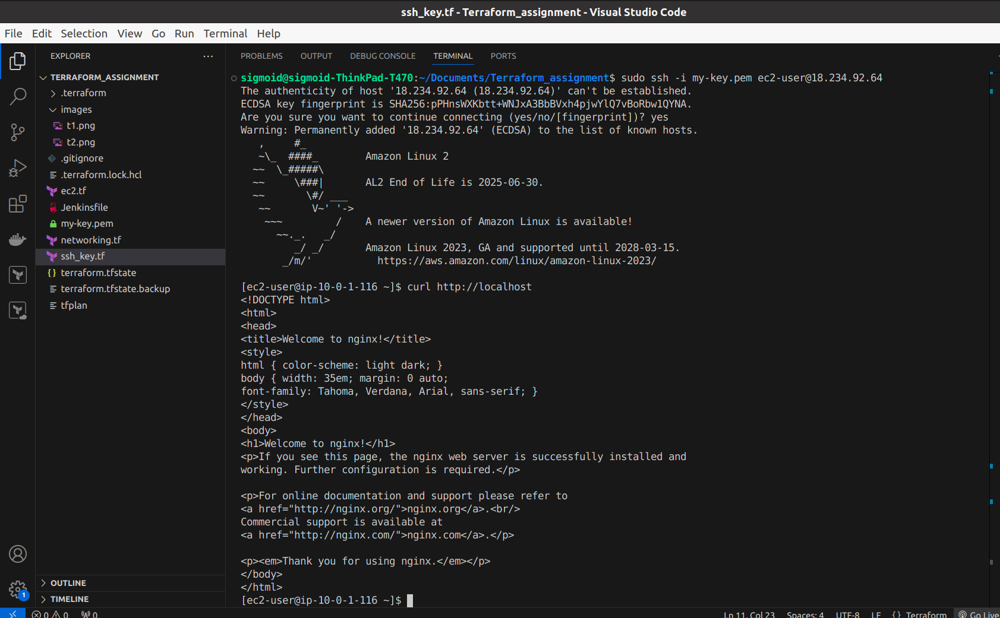
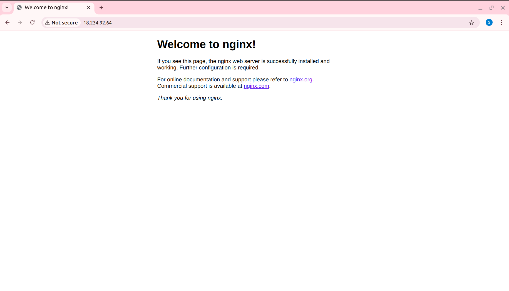
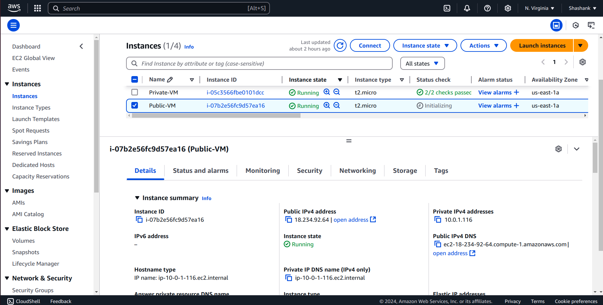

# Terraform Project: Deploy Custom VPC and EC2 VMs on AWS

Write Terraform script to create a custom VPC and deploy two EC2 VMs on AWS using Terraform.
● The code should be broken into three different parts:
● Networking (define the VPC and all of its components)
● SSH-Key (dynamically create an SSH-key pair for connecting to VMs)
● EC2 (deploy a VM in the public subnet, and deploy another VM in a private subnet)
● NGINX should be accessed for all the internet
● Automate Terraform Deployment with Jenkins Pipelines

## Instructions

### Step 1: Initialize Terraform

Navigate to the project directory and initialize Terraform:

```bash
cd terraform_project
terraform init
```

### Step 2: Validate and Plan

Validate the Terraform configuration:

```bash
terraform validate
Generate an execution plan:
```

```bash
terraform plan -out=tfplan
```

### Step 3: Deploy the Infrastructure

Apply the Terraform configuration to create the infrastructure:

```bash
terraform apply -auto-approve
```

### Access the Public VM

After deployment, retrieve the public IP of the public VM:

```bash
terraform output private_key
```

Use the public IP and private key to SSH into the public VM:

```bash
ssh -i <path-to-private-key.pem> ec2-user@<public-ip>
```

Replace <path-to-private-key.pem> with the path to your SSH private key.

### Access NGINX in your browser using the public VM's IP:

http://<public-ip>

### Clean Up Resources

To clean up and destroy the resources:

```bash
terraform destroy -auto-approve
```










